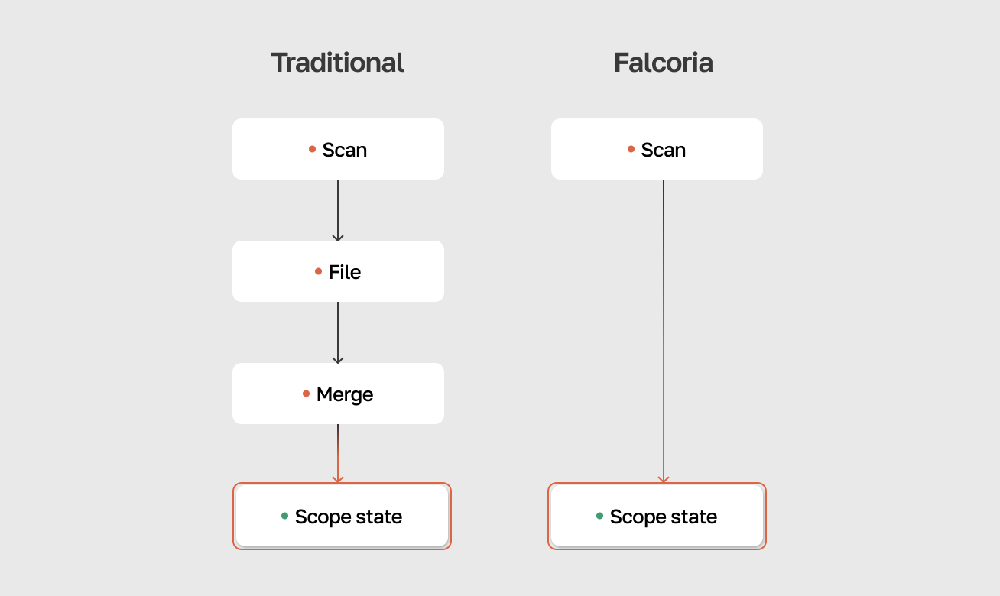

# Falcoria

Falcoria is a system for team-based port scanning on large scopes. It maintains one shared report that every scan updates — there are no separate files to merge afterwards. Each scan writes directly into a shared dataset (ScanLedger), and import modes control how new results are combined with existing data.



Full documentation: [https://falcoria.github.io/falcoria-docs/](https://falcoria.github.io/falcoria-docs/)

## Quick start

This repo runs a single-node instance with all components via Docker Compose:

```bash
git clone https://github.com/Falcoria/falcoria.git
cd falcoria
./quickstart.sh
```

The script generates TLS certificates, creates credentials, starts all services, and prints an admin token — save it for CLI configuration.

Then install [falcli](https://github.com/Falcoria/falcli) and configure the profile with the admin token. See [Getting Started](https://falcoria.github.io/falcoria-docs/getting-started/) for the full walkthrough.

## Services

- **ScanLedger** — shared state database for all scan results
- **Tasker** — target preparation and task distribution
- **Worker** — scan execution (single instance here; can be distributed separately)
- **PostgreSQL** — primary database
- **Redis** — task tracking and state
- **RabbitMQ** — message broker between Tasker and Workers

## Ports

- **443** — ScanLedger API
- **8443** — Tasker API

## Manual setup

1. Generate a TLS bundle and place it in `certs/bundle.pem`
2. Copy the example env file and fill in secrets:

```bash
cp .env.example .env
```

3. Start all services:

```bash
docker compose up -d
```

## Distributed deployment

This repo is for single-node setups. For distributed scanning — workers on separate machines, each with its own IP — deploy components individually:

| Component | Repository | Role |
|-----------|------------|------|
| ScanLedger | [Falcoria/scanledger](https://github.com/Falcoria/scanledger) | Shared state — stores and merges all scan data |
| Tasker | [Falcoria/tasker](https://github.com/Falcoria/tasker) | Target preparation and task distribution |
| Worker | [Falcoria/worker](https://github.com/Falcoria/worker) | Scan execution |
| falcli | [Falcoria/falcli](https://github.com/Falcoria/falcli) | Command-line interface |

Adding workers scales throughput linearly. See [Distribution](https://falcoria.github.io/falcoria-docs/concepts/distribution/) for details.
